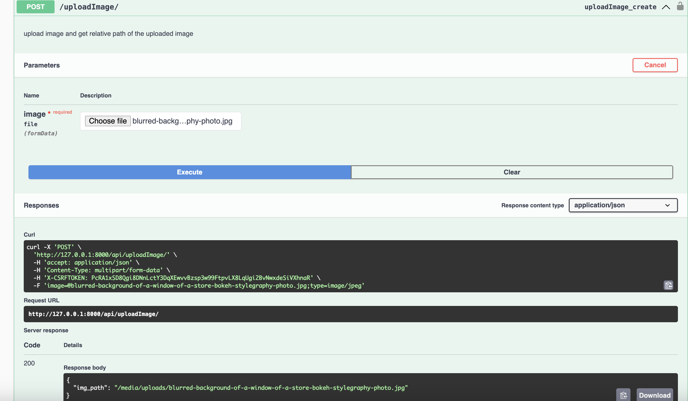
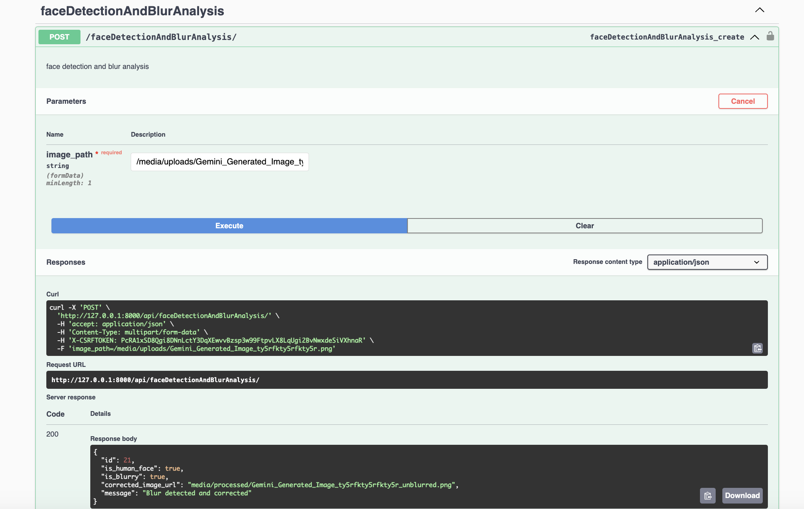
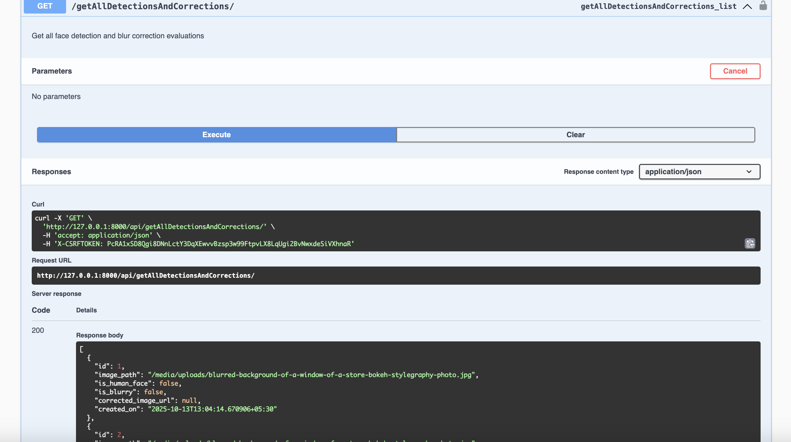
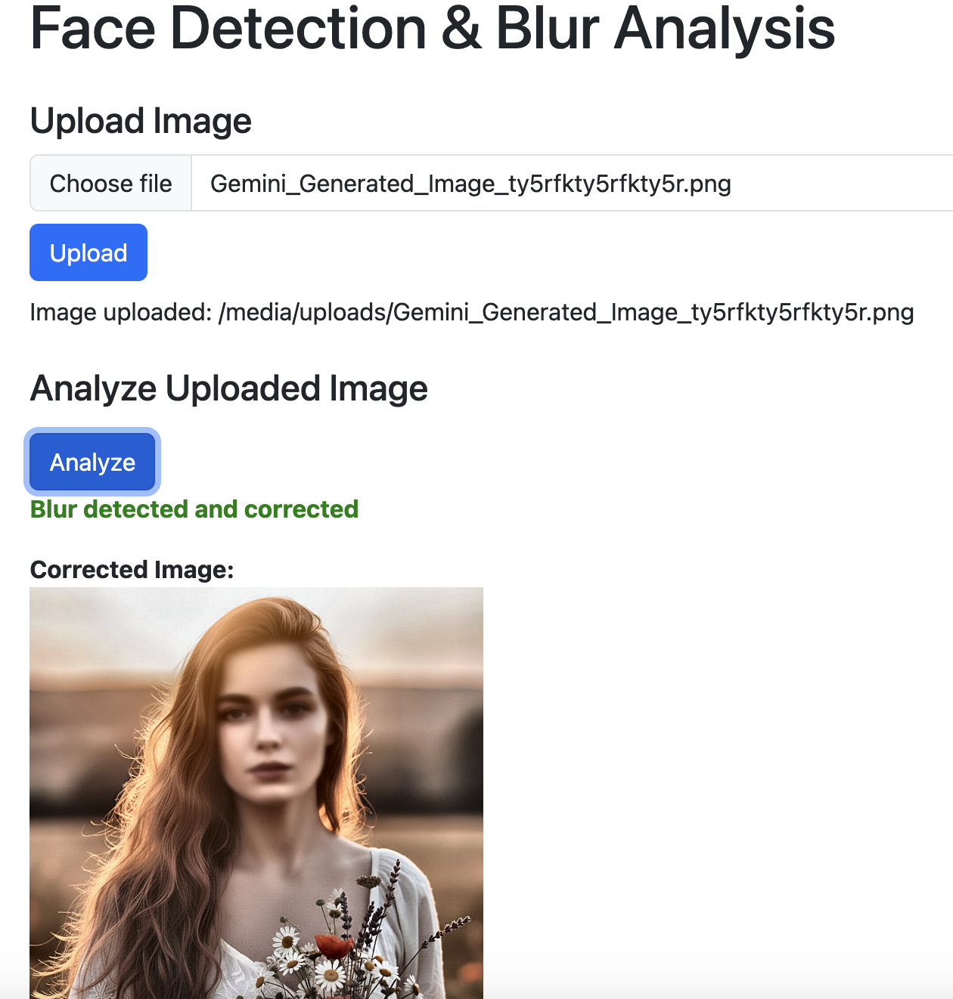
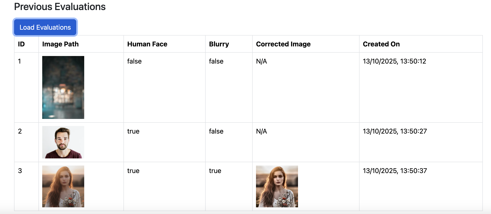

# Face Detection & Blur Correction API (Django + OpenCV)

A web-based system that allows users to upload images, analyze them for human faces and blurriness, and automatically apply corrections to blurry faces.
Built with Django REST Framework, OpenCV, and a simple frontend UI for easy interaction.
---

## User Interface (Home Page)

The home page provides three main sections:

Upload Image – Upload your image file (saved under /media/uploads/).

Analyze Uploaded Image – Enter or auto-use the uploaded image path to analyze it.

Previous Evaluations – View all saved analysis records.
##  How to Run the Project

1. **Clone the Repository:**

   ```bash
   git clone https://github.com/radhika2208/ProboApp.git
   ```

2. **(Optional) Create a Virtual Environment:**

   ```bash
   python -m venv venv
   source venv/bin/activate  # On Windows: venv\Scripts\activate
   ```

3. **Install Dependencies:**

   ```bash
   pip install -r requirements.txt
   ```
4. **Make Migrations:**

   ```bash
   python manage.py makemigrations 
   python manage.py migrate
   ```
4. **Run the Django Server**

   ```bash
   python manage.py runserver
   ```

5. **Open the HTML UI:**
    ```bash
   Open  http://127.0.0.1:8000/ for UI Interaction 
   Open http://127.0.0.1:8000/swagger/ for Swagger Docs
    ```
---

##  Structure of Input and Output

Implemented Three Apis:-

1.    Image Upload
2.    Face Detection & Blur Analysis
3.    Result Report Retrieval

### 1) Image Upload API  
**Endpoint:** `/api/uploadImage/`  
**Method:** `POST`  
**Description:** Upload an image file and receive its relative path for analysis.

#### Input (form-data)
| Key | Type | Description |
|-----|------|--------------|
| image | File | The image to upload |

#### Ouput (json)

```bash

{
  "img_path": "media/uploads/sample.jpg"
}

```



### 2) Face Detection & Blur Analysis  
**Endpoint:** `/api/faceDetectionAndBlurAnalysis/`  
**Method:** `POST`  
**Description:** Analyze an uploaded image to check whether it contains a **human face** and whether it is **blurry**.  
If the face is blurry, the API automatically generates and returns a **corrected (deblurred)** version of the image.

#### Input (x-www-form-urlencoded)
| Key | Type | Description |
|-----|------|--------------|
| image_path | string | Relative path of the uploaded image (e.g., `media/uploads/sample.jpg`) |

#### Output (JSON)

##### Case 1: No Human Face Detected
```json
{
  "id": 19,
  "message": "Not a human face",
  "is_human_face": false
}
```

##### Case 2: Human Face Detected and Not Blurry
```json
{
  "id": 20,
  "is_human_face": true,
  "is_blurry": false,
  "message": "Human face detected and not blurry"
}

```
##### Case 3: Human Face Detected and Blurry (Corrected)
```json
{
  "id": 21,
  "is_human_face": true,
  "is_blurry": true,
  "corrected_image_url": "media/processed/sample_unblurred.png",
  "message": "Blur detected and corrected"
}

```


### 3) Result Report Retrieval API
**Endpoint:** `/api/getAllDetectionsAndCorrections/`  
**Method:** `GET`  
**Description:** Fetch all face detection and blur correction records stored in the database.
#### 🧩 Input 
No Param

#### Output (JSON)
```json
[
  {
    "id": 1,
    "image_path": "media/uploads/sample.jpg",
    "is_human_face": true,
    "is_blurry": false,
    "corrected_image_url": null,
    "created_on": "2025-10-13T07:45:22Z"
  },
  {
    "id": 2,
    "image_path": "media/uploads/blur_test.jpg",
    "is_human_face": true,
    "is_blurry": true,
    "corrected_image_url": "media/corrected/blur_test_corrected.jpg",
    "created_on": "2025-10-13T07:50:10Z"
  }
]

```


---

- The HTML UI 



---

## Assumptions & Models Used

Models Used

Face Detection: OpenCV Haar Cascade — lightweight, fast, accurate for frontal faces.

Blur Detection: Variance of Laplacian — simple, effective, works on faces or the whole image.

Deblurring / Correction: CLAHE + Unsharp Masking + Bilateral Filter — enhances contrast, sharpens edges, reduces noise for natural-looking corrections.

---

## 📁 File Structure

```
face_blur_api/
├── detection/                     
│   ├── migrations/                
│   ├── __init__.py
│   ├── admin.py                   
│   ├── apps.py                    
│   ├── constants.py               
│   ├── models.py                  
│   ├── serializers.py            
│   ├── tests.py                  
│   ├── urls.py                   
│   ├── utils.py                  
│   └── views.py                  
│
├── face_blur_api/                
│   ├── __init__.py
│   ├── asgi.py
│   ├── settings.py                
│   ├── urls.py                    
│   └── wsgi.py
│
├── media/                        
│   ├── processed/                
│   ├── screenshots/              
│   └── uploads/                   
│
├── static/                       
│   └── js/
│       └── dashboard.js          
│
├── templates/                     
│   └── dashboard.html            
│
├── venv/                         
│
├── .env                           
├── db.sqlite3                    
├── manage.py                      
├── README.md                      
└── requirements.txt               

```

---

## Technologies Used

- **Python 3**
- **Django** (backend)
- **Open Cv** (Image processing)
- **HTML/CSS/JS** (UI)

---